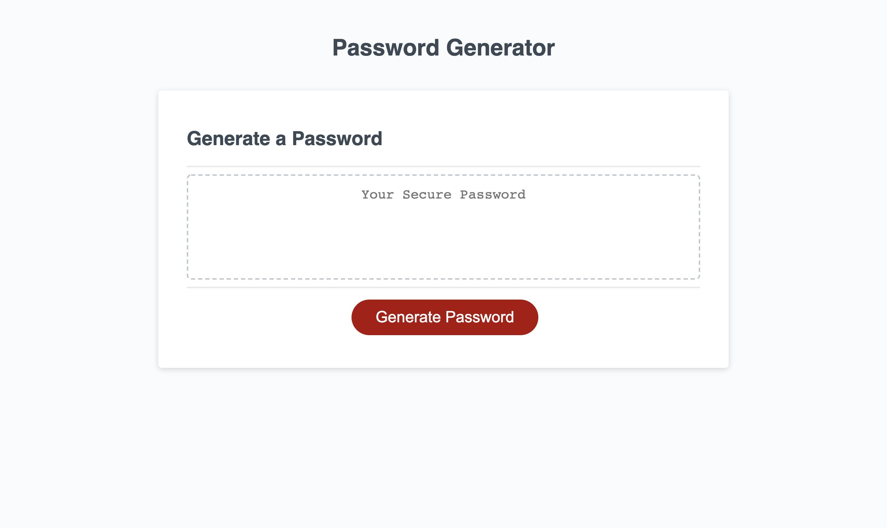
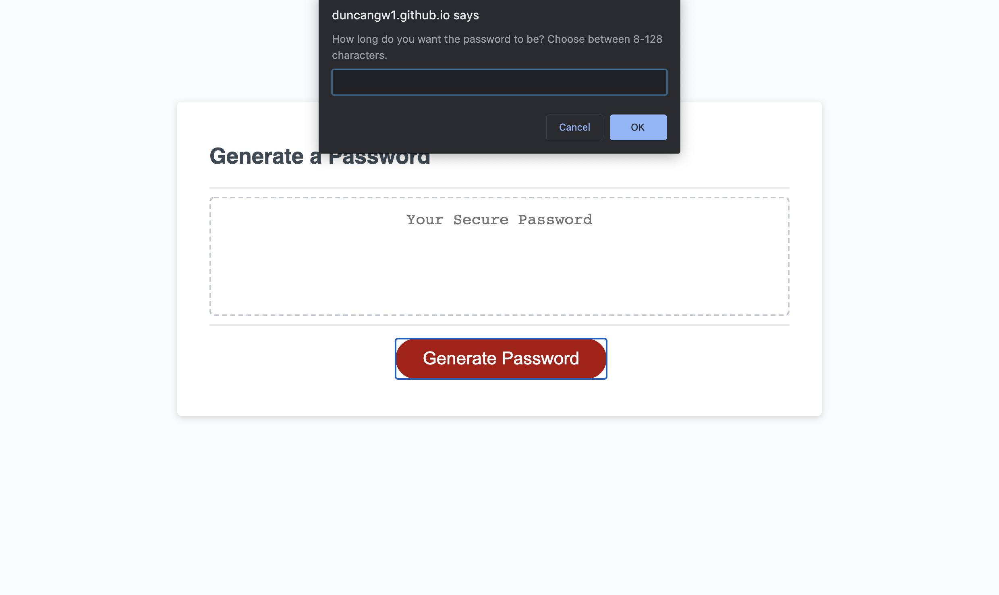
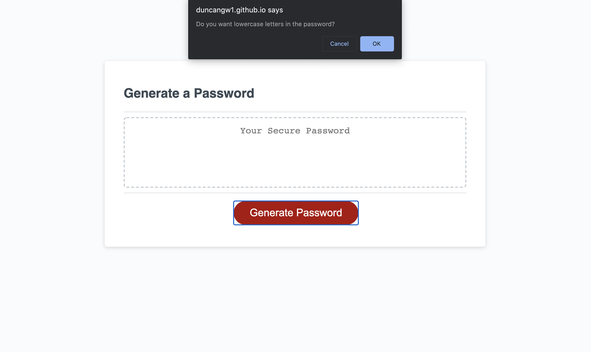
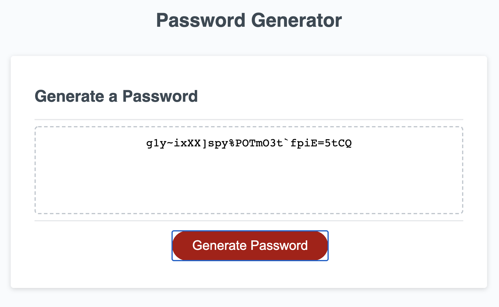

# 03 JavaScript: PasswordGenerator

This README has been created to accompany the completed JavaScript Password Generator. The purpose of this project is to allow the user to generate a random password based on their preferences for both the password length and the character types. The character type options include lowercase letters, uppercase letters, numbers, and special characters. The goal of the password generator is to provide the user with a strong customized password for increased account security.

## Link to Deployed Page

[Password Generator](https://duncangw1.github.io/PasswordGenerator/)

## Technologies Used

- HTML, CSS, JavaScript

## Screenshots

Landing Page

---

Choosing password length

---

Choosing the different character types (only the lowercase option is shown below)

---

Receiving the randomly generated password

---

## Contributors

- Gene Duncan (duncangw1)

## License & Copyright

© Gene Duncan
